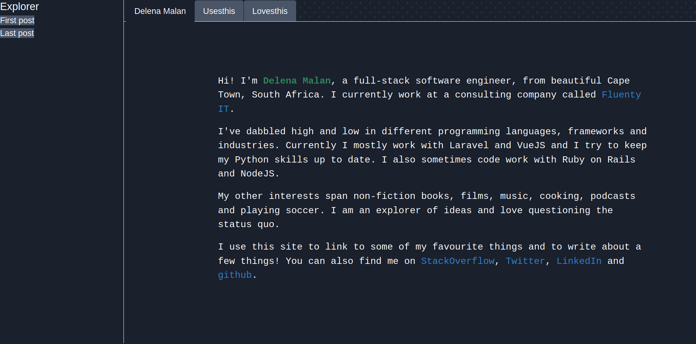

# Nuxt blog

My attempt to build a blog that looks like an IDE using 
[Nuxt](https://nuxtjs.org/) . Not completed.



## Build Setup

```bash
# install dependencies
$ npm install

# serve with hot reload at localhost:3000
$ npm run dev

# build for production and launch server
$ npm run build
$ npm run start

# generate static project
$ npm run generate
```

For detailed explanation on how things work, check out [Nuxt.js docs](https://nuxtjs.org).

### Resources

- [Heroicons](https://github.com/sschoger/heroicons-ui/tree/master/svg)
